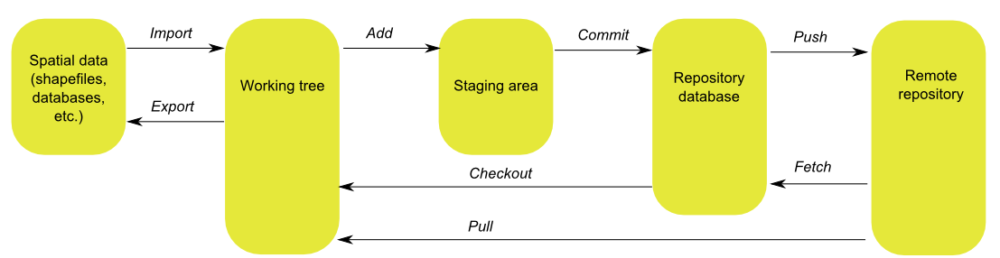

.. _start.intro:

Introduction
============

GeoGit is a **Distributed Version Control System (DVCS) specially designed to handle geospatial data**. It takes inspiration from the source code versioning system `Git <http://git-scm.com>`_, but employs an approach best suited to the nature of the data it manages.

Users familiar with Git should find it easy to use GeoGit, though some commands and ideas differ from the corresponding Git ones. For users new to version control systems, this document provides a complete description without assuming familiarity.

This user guide does not cover all possible uses of each GeoGit command, but instead introduces the most common operations and workflows. For more information, feel free to explore the GeoGit manpages to learn more about other options not covered here.

.. todo:: Need link to GeoGit manpages.

.. note:: GeoGit development is ongoing, but it is still considered unstable, so functionality is subject to change. This documentation reflects the planned functionality that should be available once a stable version is released. While almost everything described here is already implemented and functioning, deviations may occur.

GeoGit areas
------------

The following is a brief introduction to how GeoGit works and how it handles your data, and also how a GeoGit repository interacts with other repositories. These concepts will be explained in greater detail in the following sections.

GeoGit stores its content in a repository which has three areas: the **working tree**, the **staging area**, and the **database**.

* The **working tree** is the area of the repository where the work is actually done on the data. Data in the working tree is not part of a defined version, but instead can be edited and altered before turning it into a new version that will be safely stored. This means that if you put data on the working tree and then edit it (without copying it to the repository database), the version prior to those edits cannot be recovered.
* The **staging area**, sometimes also referred as the "index," is an intermediate area where data is stored before moving it to the database. Data in the staging area is said to be "staged for committing."
* The **database** is where the history of the repository is stored, and also all the versions that have been defined.

Workflow
--------

The process of versioning geospatial data consists of the following:

#. Importing geospatial data into the working tree so it can be managed by GeoGit
#. Moving data from the working tree to the staging area
#. Committing to database

.. note:: Steps 2-3 should be familiar to users of Git. Step 1 is an additional step, which is necessary to work with the specific concerns of geospatial data.

The following figure summarizes the above concepts.

.. figure:: ../img/geogit_workflow.png

   GeoGit workflow

The names in the arrows indicate the corresponding commands for each operation. All commands will be described in the following sections.

Versions
--------

As you add new data to the repository database, GeoGit creates new versions that define the history of the repository. While some versioning systems store the differences between consecutive versions, GeoGit stores the full set of objects that comprise each version. For instance, if you have changed a feature by modifying its geometry, GeoGit will store the full definition of that feature, which will be kept in the database along with the previous version of the same feature.

For features not modified from one version to another, the corresponding objects are not stored again, and the new version points to the same previous object. So while each version is a new set of objects, the data for these objects is only stored once.

.. todo:: The following figure explains this idea. 

Collaboration
-------------

GeoGit is designed to ease collaboration among people working on the same data. Your repository can accept changes from other people working on the same data, and you can share with them your own changes. Instead of a single repository, there can be an ecosystem of connected repositories, each of them working independently, but communicating and interacting when needed. GeoGit has tools to make this collaboration as easy as possible, and to ensure a fluid coordination between a group of collaborators using and editing the same dataset.

The following image shows an extended version of the GeoGit workflow presented before, including the interaction with other GeoGit repositories.

**GeoGit works independently of the storage format that you use for your data.** It handles only the versioning, ensuring that each revision is stored safely and can be recovered when needed it.

.. todo:: This statement is unclear: "Your repository might share data with the repository of another collaborator, and you can both edit that data and work on it separately. Once your work is complete and your data ready to be included in a new version, GeoGit will do its work, since it integrates orthogonally with applications and data formats."

