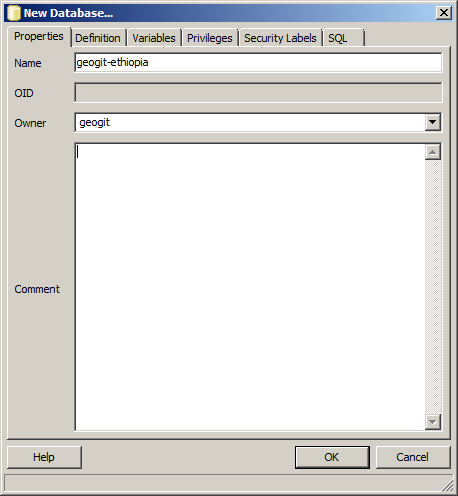
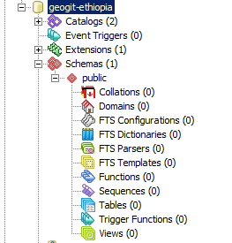

<<<<<<< .merge_file_9vOWtU
An Introduction to GeoGit
##############################

This workshop describes how to use GeoGit along with other software packages for spatial data management, showing a typical workflow.

Instructions are given for all steps performed in the workshop, both for GeoGit and for all additional applications used, but the workshop focuses primarily on GeoGit and assumes user-level knowledge of all other applications. For more information about them, please refer to the corresponding documentation of each program.

Sample data
*************

All exercises in this workshop are based on a sample dataset with OpenStreet Map data. You can download it as a zip file from `here <http://download.geofabrik.de/africa/ethiopia-latest.shp.zip>`_. Unzip it in a folder of your choice.

Prerequisites
***************

The following software is required to be installed in your system (followed by download instructions):

- GeoGit
- GeoServer with GeoGit Extension
- PostGIS (including ``shp2pgsql``)
- QGIS 2.0

GeoServer and PostGIS are installed as part of OpenGeo Suite. This workshop assumes than you are using OpenGeo Suite, but will describe independent installation of these two components. Once installed, most of the workshop tasks should be identical, and if any difference exists between the OpenGeo Suite version and the canonical one, it will be pointed out.

Installation procedures for each of the above applications are described next.

Installing GeoGit
------------------

To install GeoGit, follow these steps.

#. If not already on your system, install a `Java JDK <http://www.oracle.com/technetwork/java/javase/downloads/jdk7-downloads-1880260.html>`_. A Java JRE is not sufficient to run GeoGit.

#. After the JDK is installed, navigate to http://geogit.org and click :guilabel:`Download`.

#. Extract this archive to your preferred program directory. (For example, :file:`C:\\Program Files\\GeoGit` or :file:`/opt/geogit`.) 

   .. note:: The same packages can be used on Windows, OS X, and Linux.

#. Add the bin directory to your ``PATH`` environment variable.

When finished, you should be able to run the ``geogit --help`` and see the command usage.

Installing GeoServer with GeoGit extension
--------------------------------------------

You need to have GeoServer installed in your system, with a version higher or equal to 2.3. 

Installation instructions can be found in the `GeoServer documentation <http://docs.geoserver.org/stable/en/user/installation/index.html>`_.

.. todo:: installing geogit extension

If you are using OpenGeo Suite, GeoServer should already be installed in your system, but it does not contain the GeoGit extension. You can skip the GeoServer installation, but you should install the GeoGit extension as described above.

Installing PostGIS
--------------------

To install PostGIS, first you must install PostgresSQL. Binaries are available for different OSs `here <http://www.postgresql.org/download/>`_.

Then, install PostGIS on your PostgreSQL. Packages and iinstall instructions are found `here <http://postgis.net/install>`_.

As in the case of GeoServer, if you have installed the OpenGeo Suite, you should already have PostGIS, including the ``shp2pgsql`` utility, installed.

Installing QGIS
----------------

To install QGIS 2.0, you can download binaries from the `QGIS website <http://www.qgis.org/en/site/forusers/download.html>`_.

.. todo: mention problem with gdal versions in linux?

The OpenGeo Explorer plugin is used in this workshop. It is not a core plugin and it has to be installed manually. Installation instructions can be found in the `OpenGeo Explorer documentation site <http://qgis.opengeo.org/static/docs/intro.html>`_.

Setting up
***********

Once the above software is installed, some initialization is needed before starting working with them. In particular, PostGIS and GeoGit both need to be set up, and the setting up procedures are detailed next.

Setting up GeoGit
------------------

A user has to be defined in GeoGit before you can commit data to a GeoGit repository and create new snapshots.

To define a new user, open a console and type the following.

.. code-block:: console

   geogit config --global user.name "Author"
   geogit config --global user.email "author@example.com"

    
Replace the user name and user email with your own credentials 

All commits that you do now will be contain that author information. Individual user name and email can be defined for a give repository, but if those are not defined, GeoGit will use the global value that we have set up with the above commands.

Setting up PostGIS
--------------------

A database is required to work with PostGIS. We will create a new database named ``workshop`` that we will use for storing all the data used in this workshop.

The database can be created from the *pgAdmin II* utility. Open *pgAdmin III*

.. figure:: ../img/pgadmin.png

You should have a single server entry. Double-click on it to connect and enter ``postgres`` as the password in the dialog that will appear.

We will now create a user that we will use for connecting to the database.

In the object browser, under *Login roles* you should have a single user name *postgres*. Right-click on the *Login roles* item and select *New login role*.

.. figure:: ../img/new_role.png

Fill the first tab of the dialog as shown below, entering ``geogit`` as the user name

.. figure:: ../img/create_role.png

In the second tab, enter the password corresponding to that user (use ``geogit`` as password)

.. figure:: ../img/create_role2.png

In the *Priviledges* tab, make sure the *Superuser* box is checked, to allow the user full permission.

.. figure:: ../img/create_role3.png

Now the user should be defined. Let's create the database.

Right-click on the *Databases* item and select *New Database*.

Fill in the *New Database* form as shown below and click *OK*.

- *Name*: ``geogit-ethiopia``
- *Owner*: ``geogit``
- *Encoding*: ``UTF8``
- *Template* ``template_postgis`` (``postgis_21_sample`` in case you have installed PostGIS manually and not as part of OpenGeo Suite)

.. figure:: ../img/pgadmin_03.png

The template and encoding are specified on the *Definition* panel.

.. figure:: ../img/pgadmin_03a.png

The tabe is now created and we can already add data to it and create new tables in it.

Preparing and importing the data 
**********************************

The sample data zip file contains several shapefiles that we can import into the PostGIS database that we have just created.

We can use QGIS to do the import. First, start QGIS.

.. figure:: ../img/qgis.png

Make sure that the QGIS browser is visible, by enabling it in the *View/Panels* menu. It should appear by default on the left-hand side of youor QGIS window.

.. figure:: ../img/qgis_browser.png

Open the OpenGeo Explorer (go to the *OpenGeo* menu), which should appear on the right hand side of your QGIS window.

.. figure:: ../img/opengeo_explorer.png

Now define a connection to the PostGIS database. Right click on the *PostGIS connections* entry in the browser, right-click on it and select *New connection*. Fill the dialog as shown below.

.. figure:: ../img/new_connection.png

Use ``geogit`` as pasword. If you are running a standard PostGIS instead of the OpenGeo Suite one, your port would probaly be 5432 instead of 54321.

The *PostGIS connections* entry should be updated and populated with the current connections defined in QGIS, among them the one that you have just created.

.. figure:: ../img/geogit_db_connections.png

You can import layers by simply dragging and dropping the corresponding files from the browser and into the connection item in the OpenGeo Explorer (you can also drop them into the PostGIS item in the QGIS browser, but that is not so practical and it will not give you the option to import as single geometries, which is important in this case for some of the work we are going to do later).

Select all the shapefiles from the sample dataset and drop them into the connection that we have defined.

.. figure:: ../img/drag_drop_files.png

A dialog will be shown to configure some parameters before importing. Make sure you set them as shown in the figure below.

.. figure:: ../img/import_pg_dialog.png

It is important to check the *Import as single geometries* check box, since, as we said, that will be needed for our further work.

Click on *OK* and the files will be imported, creating a separate table for each of them.

.. figure:: ../img/geogit_db_with_tables.png

Exploring the data in QGIS
***************************

You can open any of these tables in QGIS to visualize it and explore it. To do it, just drag and drop the corresponing table item into the QGIS canvas and a new layer will be created. Add the *buildings* layer.

.. figure:: ../img/drag_layer_to_canvas.png

It should be shown in the QGIS canvas to its full extent.

.. figure:: ../img/buildings_layer.png

To enhance the visualization, you can add a base layer. A very useful plugin is the OpenLayers plugin, which greatly simplifies adding some of the most common base layers, such as Google, Bing or OSM. You can install it opening the Plugin Manager, selecting the *Get more* section and then searching for *OpenLayer*

.. figure:: ../img/install_ol.png

Now in the *Plugins* menu you should have a new entry where you can select the layers to add.

.. figure:: ../img/openlayers.png

Below you can see the buildings layer with the Bing aerial image, zoomed on the city of Adis Ababa.

.. figure:: ../img/bing_buildings.png

You can query the data in the PostGIS layer to know more about the buildings it contain. Select the identify tool by going to the *View/Identify features* menu entry. Now select the buildings layer by clicking on its name in the layers list. Click on any of the polygons and a dialog like the one shown below will appear, containing information corresponding to that polygon.

.. figure:: ../img/identify.png

The full table of attributes for all the features in the layer can be shown by right--clicking on the layer name and selecting *Open Attribute Table* in the context menu.

.. figure:: ../img/attribute_table.png

Creating a GeoGit repository and importing data
*************************************************

The PostGIS database already contains the data we are going to work with, so we can now initialize a GeoGit repository where we will keep all the history and different version of that data. The PostGIS database will be the one we will work with to edit and extend the data it contains, and the GeoGit repository will store the history of that work.

Open a console and move to a folder where you want to keep you geogit repo. Under it, create a folder named ``geogit_ethiopia`` and move into it.

::

    $ mkdir geogit_ethiopia
    $ cd geogit_ethiopia

To initialize a GeoGit repository there, run the following command.

::

    $ geogit init
    Initialized empty Geogit repository in [parent_folder]\geogit_ethiopia\.geogit

If you look at the content of the folder now, you will see that a folder named ``.geogit`` has been created. That is where all the data of the repository will be stored.

To import the data from the PostGIS database, run the following commands:

::

    $ geogit pg import --database geogit_ethiopia --port 54321 --user geogit --password geogit --all 

This tells GeoGit that you want all tables in the geogit database, and uses the credentials of the ``geogit`` user that we created to connect to the database. For each table in the PostGIS database, it will create a new tree in the repository. 

Oonce imported, the data will be in the so called *working tree*. It is not yet stored in the repository database and it does not constitute a version of the data, but you can see that there are changes in the working tree by running the ``status`` command.

::

    $ geogit status

    # On branch master
    # Changes not staged for commit:
    #   (use "geogit add <path/to/fid>..." to update what will be committed
    #   (use "geogit checkout -- <path/to/fid>..." to discard changes in working directory
    #
    #      added  points
    #      added  points/127
    #      added  points/2077
    #      added  points/695
    #      added  points/525
    #      added  points/1532
    #      added  points/1551
    #      added  points/2414
    #      added  points/1931
    [...]
    #      added  points/1598
    # 92043 total.

There are 92043 new features in the working tree. To see how they are organized in the working tree, use the ``ls`` command

::

    $ geogit ls
    Root tree/
        points/
        landuse/
        waterways/
        railways/
        natural/
        buildings/
        places/
        roads/

Each one of the trees above correspond to one of the tables that have been imported.

Creating a new snapshot in the repository
******************************************

You can add the feature in the wroking tree to the staging area by using the ``add`` command. From there, they are ready to be used to create a new version.

::

    $ geogit add
    Staging changes...
    100%
    92035 features and 8 trees staged for commit
    0 features and 0 trees not staged for commit

Creating a new snapshot is done with the ``commit`` command. Enter the following in the console.

::

    $geogit commit -m "Initial add"
    [fc9e9e6d97e979293a028857d275eef31e8a0ce5] Initial add
    Committed, counting objects...92035 features added, 0 changed, 0 deleted.

The new version is now created and is identified with the "Initial add" message.

Examining the log
*****************

You can explore the repository history using the ``log`` command.

::

    $ geogit log
    Commit:  fc9e9e6d97e979293a028857d275eef31e8a0ce5
    Author:  volaya <volaya@opengeo.org>
    Date:    (9 minutes ago) 2013-10-31 10:57:02 +0100
    Subject: Initial add

Right now, there is only one commit, but as we work on our data and create new snapshot, we will be adding more. Notice that each commit has a message that you define when running the ``commit`` command, but it is also identified with a unique 40-character string ((``fc9e9e6d97e979293a028857d275eef31e8a0ce5`` in the example above but you will not have the same one, since it is computed based on the properties of the commit such as the commit date, which will be different in your case) . You can use these string to refer to all kinds of elements in a GeoGit repository, since all of them have one of such identifiers. We will see examples of that later on.

Editing the PostGIS data in QGIS
**********************************

We can now go back to QGIS and work on our data.

Make sure you have the *building* layer opened in QGIS, based on a connection to the ``buildings`` table in the ``geogit_ethiopia`` database.

The Bing image that we have added as base layer shows some building that are not digitized and included in the *buildings* vector layer. We will digitize one of them and then create a new snapshot in the GeoGit repository with the updated data.

Open the attributes table of the *buildings* layer and locate the feature with the identifier ``10011`` (features are ordered by ID by default). Select the corresponding row and then click on the *Zoom map to the selected rows* button. This will zoom your view to an area where there is a large building that is missing in the *buildings* layer and we can digitize. 

.. figure:: ../img/10011.png

You can zoom out one level to see it more clearly.

.. figure:: ../img/to_digitize.png

Right click on the layer name in the layers list and select *Toggle editing*. That will put the layer in edit mode, so you can add new features, delete them, or edit them.

Select *Add feature* from the *Edit* menu.

.. figure:: ../img/add_feature.png

Now you can click on the canvas to add points to delineate the building that we want to digitize. Once you have entered all the points, right-click to finish editing the geometry. A dialog will appear where you should enter the attributes corresponding to the new feature you are adding.

.. figure:: ../img/new_feature_attributes.png

Since we do not know the ``osm_id``, you can leave that field blank. The expression in the first field will assign a correlative id to the feature based on the id's used by the other features in the layer. Click on *OK* an the new feature will be added.

that feature is still only in the editing buffer, and hasn't been stored in the database that contains the layer data. To store the changes, right-click on the layer name and select *Toggle editing* again. QGIS will ask you if you want to save your edits.

.. figure:: ../img/save_edits.png

Click on *Yes* and your PostGIS database will be updated.

Commit changes from PostGIS to GeoGit repository
*************************************************

The database now contains different data to the one that we imported into Geogit and used to create the first snapshot. We can create a new snapshot by reimporting the modified database and following a process similar to the one we followed for the first import.

First, import the data entering the following command ini the console.

::

    $ geogit pg import --database geogit_ethiopia --user geogit --password geogit --table buildings --port 54321
    Importing from database geogit_ethiopia

    Importing buildings        (1/1)...
    100%
    Import successful.

We have just modified the *buildings* table, so there is not need to reimport all the rest of tables. The ``--all`` argument has been replaced by ``--table buildings`` to indicate that we just want to import the *buildings* table.

We can check that the imported table is different from the one in the repository, by running the ``status`` command.

::

    $ geogit status
    # On branch master
    # Changes not staged for commit:
    #   (use "geogit add <path/to/fid>..." to update what will be committed
    #   (use "geogit checkout -- <path/to/fid>..." to discard changes in working directory
    #
    #      added  buildings/12976
    # 1 total.

It reports that a new feature has been added. 

To put that new feature in the stagin area, run the ``add`` command.
    
::

    $ geogit add
    Counting unstaged elements...1
    Staging changes...
    100%
    1 features and 0 trees staged for commit
    0 features and 0 trees not staged for commit

And then use the ``commit`` command to create a new snapshot.
::

    $ geogit commit -m "Added building"
    100%
    [c1a072734c9de17dc98dfec74d8ce169b94b90c2] Added buildings
    Committed, counting objects...1 features added, 0 changed, 0 deleted.

Inspecting the log and the differences between snapshots
********************************************************
    
The history of the repository now contains two different snapshots. The output of the ``log`` command will now show something like this:

::

    $ geogit log    
    Commit:  c1a072734c9de17dc98dfec74d8ce169b94b90c2
    Author:  volaya <volaya@opengeo.org>
    Date:    (1 minutes ago) 2013-10-31 11:45:07 +0100
    Subject: Added building

    Commit:  fc9e9e6d97e979293a028857d275eef31e8a0ce5
    Author:  volaya <volaya@opengeo.org>
    Date:    (49 minutes ago) 2013-10-31 10:57:02 +0100
    Subject: Initial add

The differences between any two commits can be inspected using the ``diff`` command and passing the identifiers of those commits. To see the difference between the two commits in out GeoGit repository, enter the following command in the console.

::

    $ geogit diff fc9e9e6d97e979293a028857d275eef31e8a0ce5 c1a072734c9de17dc98dfec74d8ce169b94b90c2 
    000000... 9efbde... 000000... e0c8d1...   A  buildings/12976
    geom    MULTIPOLYGON (((38.7636514300226 9.059704893617495, 38.764011782062425 9.059795013128007, 38.764053901132016 9.059554694383088, 38.7639837026827 9.059543140593222, 38.76399774237257 9.05946226405379, 38.763838625887445 9.059432224191653, 38.76382692614589 9.05950154694665, 38.76368652924725 9.059471507087796, 38.7636514300226 9.059704893617495)))
    osm_id
    name
    type
        

It reports that this commit introduced a new feature (``building/12976``), with the above attributes (which are empty except for the goemetry itself, since we did not specify them).

There is actually no need to use the full identifiers of the commits. You can abbreviate them, for instance using the first five digits, as in the next example.

::

    $ geogit diff fc9e9 c1a07     

If there is ambiguity and any of those shortened identifiers cannot be resolved to one and only one full identifier, GeoGit will tell you to enter a more detailed one.

The first identifier is the original version, while the second one is the final version. Reversing them will give you the opposite difference

::

    $ geogit diff c1a07 fc9e9 
    9efbde... 000000... e0c8d1... 000000...   R  buildings/12976

Removals (``R``) are not detailed like in the case of additions (``A``). Just the name of the removed feature is shown instead.

GeoGit support several syntaxes to specify the commits you want to compare with the ``diff`` command or any other command that takes a commit as input. The next line will produce the same output as the one using the full identifiers.

::

    $ geogit diff HEAD~1 HEAD

``HEAD`` refers to the current last commit in the history, while ``HEAD~1`` refers to its parent (the previous commit). This line will compare the two last commits, without having to know their identifiers.

Cloning the repo from the filesystem
*************************************

One of the most important features of GeoGit is that data can be synchronized between repositories, so you can have several of them versioning the same data and share the changes made in each them with the other repositories.

You can create a new local copy of your repository by running the ``clone``. Move to the parent directory of your repository folder and enter this in the console:

::
    
    $geogit clone ./geogit-ethiopia geogit-ethiopia-clone
    Cloning into 'geogit-ethiopia-clone'...
    100%
    Done.

Now you should have two folders, ``geogit-ethiopia`` and ``geogit-ethiopia-clone``, each of them corresponding to a GeoGit repository. If you change your current directory to one of them, the geogit commands that you run will apply to the repository contained in that folder.

Right now, both repositories are identical. You can check that by moving into the ``geogit-ethiopia-clone`` folder and inspecting the log of the GeoGit repository it contains.

::

    $ cd geogit-ethiopia-clone
    $ geogit log
    Commit:  c1a072734c9de17dc98dfec74d8ce169b94b90c2
    Author:  volaya <volaya@opengeo.org>
    Date:    (1 minutes ago) 2013-10-31 11:45:07 +0100
    Subject: Added building

    Commit:  fc9e9e6d97e979293a028857d275eef31e8a0ce5
    Author:  volaya <volaya@opengeo.org>
    Date:    (49 minutes ago) 2013-10-31 10:57:02 +0100
    Subject: Initial add

We will add more snapshots to the original repository and then see how to synchronize with the cloned one, so the cloned one gets the changes that we have introduced in the original repository.

Making more edits to the PostGIS database
********************************************

Go back to QGIS and make some more edits. You can add a new building from the ones that are not in yet digitized. Also, let's make a modification so we can later see how GeoGit handles that kind of edits. The feature with the id ``8868`` represents and administrative building, but its ``type`` attribute is ``NULL``. Correct that by entering ``administrative`` in the corresponding cell in the attribute table. When the layer is in edit mode you can edit table cells by double--clicking on them.

Save the changes to the PostGIS database as it has already been explained.

Commiting edits to original GeoGit Repo
*****************************************

Go to the console and create a new version by importing, adding and commiting your changes. Make sure you are under the ``geogit-ethiopia`` folder, so you are commiting to the original repository, not the cloned one.

The commands are the same one that we used for creating our second commit, except for the commit message.

::

    $ geogit pg import --database geogit_ethiopia --user geogit --password geogit --table buildings --port 54321
    $ geogit add
    $ geogit commit -m "Added more buildings and corrected missing field value"

The differences between the two last commits now look like this.

::

    $ geogit diff HEAD~1 HEAD 
    9efbde... 9efbde... 546e31... 62c2e8...   M  buildings/8868
    type: [MISSING] -> administrative

    000000... 9efbde... 000000... cacef3...   A  buildings/12977
    geom    MULTIPOLYGON (((38.75429818070351 9.061127964604221, 38.75435886071902 9.060998131885604, 38.7545105607578 9.061028093286371, 38.754490334085965 9.061147938864453, 38.75429818070351 9.061127964604221)))
    osm_id
    name
    type       

It shows the modifications done to the attributes of a existing feature, and the description of a newly added feature.

Pulling changes into the cloned repository
*******************************************

If you move to the ``geogit-ethiopia`` folder and see the log of the repository, you will see that the last commit that we made is not here. Repositories are independent, and the changes were only commited to the original repository. However, we can bring those changes to the cloned repository, by using the ``pull`` command.

::

    $ geogit pull
    100%
    From [parentfolder]/geogit_ethiopia/
       c1a0727..82c4634     master -> refs/heads/master
    Features Added: 1 Removed: 0 Modified: 1

If you now run the ``log`` command you will see that there are 3 commits in the cloned repository, and it has the same history as the original one.

Running the ``diff`` command will also produce the same results as in the original repository.

You can pull changes from any repository that versions the same data. In that case, you should tell the ``pull`` command how to find that repository. In this case, however, we are pulling from the default parent repository, which is the original one. When a repository is cloned, GeoGit saves a reference to the original repository, which is used by the pull command to pull changes from in case that no repository has been specified when calling it.

Expose Clone with Webservices using GeoServer
**********************************************   

Add the clone as a remote to the original repo:

.. code::

 geogit remote http://localhost:8080/geoserver/geogit/opengeo:ethiopia 

Make more Edits against PostGIS in QGIS:

#. Start an editing session
#. Add new features
#. Modify existing features
#. Modify existing attributes
#. End editing session and save

Import Edits to original repo:

.. code::

 geogit pg import
 geogit add
 geogit commit -m "More building changes"

Push edits to clone via remote API
***********************************
    
    To pass changes from one repository, you can use the ``pull`` command as we have already seen, or you can *send* changes to a remote repository with the push command. Let's see how to move the latest changes in the original repository, to the clone repository.

    the original repository doesn't know anything about the clone one, so you have to add a reference to it, using the ``remote add`` command.

::

    $ geogit remote add cloned http://localhost:8080/geoserver/geogit/opengeo:ethiopia

You can check that the remote reference has been added, by listing all available remotes

::

    $ geogit remote list -v
    clone http://localhost:8080/geoserver/geogit/opengeo:ethiopia (fetch)
    clone http://localhost:8080/geoserver/geogit/opengeo:ethiopia (push)

=======
An Introduction to GeoGit
##############################

This workshop describes how to use GeoGit along with other software packages for spatial data management, showing a typical workflow.

Instructions are given for all steps performed in the workshop, both for GeoGit and for all additional applications used, but the workshop focuses primarily on GeoGit and assumes user-level knowledge of all other applications. For more information about them, please refer to the corresponding documentation of each program.

Sample data
*************

All exercises in this workshop are based on a sample dataset with OpenStreet Map data. You can download it as a zip file from `here <http://download.geofabrik.de/africa/ethiopia-latest.shp.zip>`_. Unzip it in a folder of your choice.

Prerequisites
***************

The following software is required to be installed in your system (followed by download instructions):

- GeoGit
- GeoServer with GeoGit Extension
- PostGIS (including ``shp2pgsql``)
- QGIS 2.0

GeoServer and PostGIS are installed as part of OpenGeo Suite. This workshop assumes than you are using OpenGeo Suite, but will describe independent installation of these two components. Once installed, most of the workshop tasks should be identical, and if any difference exists between the OpenGeo Suite version and the canonical one, it will be pointed out.

Installation procedures for each of the above applications are described next.

Installing GeoGit
------------------

To install GeoGit, follow these steps.

#. If not already on your system, install a `Java JDK <http://www.oracle.com/technetwork/java/javase/downloads/jdk7-downloads-1880260.html>`_. A Java JRE is not sufficient to run GeoGit.

#. After the JDK is installed, navigate to http://geogit.org and click :guilabel:`Download`.

#. Extract this archive to your preferred program directory. (For example, :file:`C:\\Program Files\\GeoGit` or :file:`/opt/geogit`.) 

   .. note:: The same packages can be used on Windows, OS X, and Linux.

#. Add the bin directory to your ``PATH`` environment variable.

When finished, you should be able to run the ``geogit --help`` and see the command usage.

Installing GeoServer with GeoGit extension
--------------------------------------------

You need to have GeoServer installed in your system, with a version higher or equal to 2.3. 

Installation instructions can be found in the `GeoServer documentation <http://docs.geoserver.org/stable/en/user/installation/index.html>`_.

.. todo:: installing geogit extension

If you are using OpenGeo Suite, GeoServer should already be installed in your system, but it does not contain the GeoGit extension. You can skip the GeoServer installation, but you should install the GeoGit extension as described above.

Installing PostGIS
--------------------

To install PostGIS, first you must install PostgresSQL. Binaries are available for different OSs `here <http://www.postgresql.org/download/>`_.

Then, install PostGIS on your PostgreSQL. Packages and iinstall instructions are found `here <http://postgis.net/install>`_.

As in the case of GeoServer, if you have installed the OpenGeo Suite, you should already have PostGIS, including the ``shp2pgsql`` utility, installed.

Installing QGIS
----------------

To install QGIS 2.0, you can download binaries from the `QGIS website <http://www.qgis.org/en/site/forusers/download.html>`_.

.. todo: mention problem with gdal versions in linux?

The OpenGeo Explorer plugin is used in this workshop. It is not a core plugin and it has to be installed manually. Installation instructions can be found in the `OpenGeo Explorer documentation site <http://qgis.opengeo.org/static/docs/intro.html>`_.

Setting up
***********

Once the above software is installed, some initialization is needed before starting working with them. In particular, PostGIS and GeoGit both need to be set up, and the setting up procedures are detailed next.

Setting up GeoGit
------------------

A user has to be defined in GeoGit before you can commit data to a GeoGit repository and create new snapshots.

To define a new user, open a console and type the following.

.. code-block:: console

   geogit config --global user.name "Author"
   geogit config --global user.email "author@example.com"

    
Replace the user name and user email with your own credentials 

All commits that you do now will be contain that author information. Individual user name and email can be defined for a give repository, but if those are not defined, GeoGit will use the global value that we have set up with the above commands.

Setting up PostGIS
--------------------

A database is required to work with PostGIS. We will create a new database named ``geogit-ethiopia`` that we will use for storing all the data used in this workshop.

The database can be created from the *pgAdmin II* utility. Open *pgAdmin III*

.. figure:: ../img/pgadmin.png

You should have a single server entry. Double-click on it to connect and enter ``postgres`` as the password in the dialog that will appear.

We will now create a user that we will use for connecting to the database.

In the object browser, under *Login roles* you should have a single user name *postgres*. Right-click on the *Login roles* item and select *New login role*.

.. figure:: ../img/new_role.png

Fill the first tab of the dialog as shown below, entering ``geogit`` as the user name

.. figure:: ../img/create_role.png

In the second tab, enter the password corresponding to that user (use ``geogit`` as password)

.. figure:: ../img/create_role2.png

In the *Priviledges* tab, make sure the *Superuser* box is checked, to allow the user full permission.

.. figure:: ../img/create_role3.png

Now the user should be defined. Let's create the database.

Right-click on the *Databases* item and select *New Database*.

Fill in the *New Database* form as shown below and click *OK*.

- *Name*: ``geogit-ethiopia``
- *Owner*: ``geogit``

Select the new ``workshop`` database and open it up to display the tree of objects. You’ll see the ``public`` schema.

Click on the SQL query button indicated below (or go to Tools > Query Tool).

.. figure:: ../img/sql_query.png

Enter the following query into the query text field to load the PostGIS spatial extension:

::

    CREATE EXTENSION postgis;

Click the Play button in the toolbar (or press F5) to *Execute the query.*

The database is now created and we can already add data to it and create new tables in it.

Preparing and importing the data 
**********************************

The sample data zip file contains several shapefiles that we can import into the PostGIS database that we have just created.

We can use QGIS to do the import. First, start QGIS.

.. figure:: ../img/qgis.png

Make sure that the QGIS browser is visible, by enabling it in the *View/Panels* menu. It should appear by default on the left-hand side of youor QGIS window.

.. figure:: ../img/qgis_browser.png

Open the OpenGeo Explorer (go to the *OpenGeo* menu), which should appear on the right hand side of your QGIS window.

.. figure:: ../img/opengeo_explorer.png

Now define a connection to the PostGIS database. Right click on the *PostGIS connections* entry in the browser, right-click on it and select *New connection*. Fill the dialog as shown below.

.. figure:: ../img/new_connection.png

Use ``geogit`` as pasword. If you are running a standard PostGIS instead of the OpenGeo Suite one, your port would probaly be 5432 instead of 54321.

The *PostGIS connections* entry should be updated and populated with the current connections defined in QGIS, among them the one that you have just created.

.. figure:: ../img/geogit_db_connections.png

You can import layers by simply dragging and dropping the corresponding files from the browser and into the connection item in the OpenGeo Explorer (you can also drop them into the PostGIS item in the QGIS browser, but that is not so practical and it will not give you the option to import as single geometries, which is important in this case for some of the work we are going to do later).

Select all the shapefiles from the sample dataset and drop them into the connection that we have defined.

.. figure:: ../img/drag_drop_files.png

A dialog will be shown to configure some parameters before importing. Make sure you set them as shown in the figure below.

.. figure:: ../img/import_pg_dialog.png

It is important to check the *Import as single geometries* check box, since, as we said, that will be needed for our further work.

Click on *OK* and the files will be imported, creating a separate table for each of them.

.. figure:: ../img/geogit_db_with_tables.png

Exploring the data in QGIS
***************************

You can open any of these tables in QGIS to visualize it and explore it. To do it, just drag and drop the corresponing table item into the QGIS canvas and a new layer will be created. Add the *buildings* layer.

.. figure:: ../img/drag_layer_to_canvas.png

It should be shown in the QGIS canvas to its full extent.

.. figure:: ../img/buildings_layer.png

To enhance the visualization, you can add a base layer. A very useful plugin is the OpenLayers plugin, which greatly simplifies adding some of the most common base layers, such as Google, Bing or OSM. You can install it opening the Plugin Manager, selecting the *Get more* section and then searching for *OpenLayer*

.. figure:: ../img/install_ol.png

Now in the *Plugins* menu you should have a new entry where you can select the layers to add.

.. figure:: ../img/openlayers.png

Below you can see the buildings layer with the Bing aerial image, zoomed on the city of Adis Ababa.

.. figure:: ../img/bing_buildings.png

You can query the data in the PostGIS layer to know more about the buildings it contain. Select the identify tool by going to the *View/Identify features* menu entry. Now select the buildings layer by clicking on its name in the layers list. Click on any of the polygons and a dialog like the one shown below will appear, containing information corresponding to that polygon.

.. figure:: ../img/identify.png

The full table of attributes for all the features in the layer can be shown by right--clicking on the layer name and selecting *Open Attribute Table* in the context menu.

.. figure:: ../img/attribute_table.png

Creating a GeoGit repository and importing data
*************************************************

The PostGIS database already contains the data we are going to work with, so we can now initialize a GeoGit repository where we will keep all the history and different version of that data. The PostGIS database will be the one we will work with to edit and extend the data it contains, and the GeoGit repository will store the history of that work.

Open a console and move to a folder where you want to keep you geogit repo. Under it, create a folder named ``geogit_ethiopia`` and move into it.

::

    $ mkdir geogit_ethiopia
    $ cd geogit_ethiopia

To initialize a GeoGit repository there, run the following command.

::

    $ geogit init
    Initialized empty Geogit repository in [parent_folder]\geogit_ethiopia\.geogit

If you look at the content of the folder now, you will see that a folder named ``.geogit`` has been created. That is where all the data of the repository will be stored.

To import the data from the PostGIS database, run the following commands:

::

    $ geogit pg import --database geogit_ethiopia --port 54321 --user geogit --password geogit --all 

This tells GeoGit that you want all tables in the geogit database, and uses the credentials of the ``geogit`` user that we created to connect to the database. For each table in the PostGIS database, it will create a new tree in the repository. 

Oonce imported, the data will be in the so called *working tree*. It is not yet stored in the repository database and it does not constitute a version of the data, but you can see that there are changes in the working tree by running the ``status`` command.

::

    $ geogit status

    # On branch master
    # Changes not staged for commit:
    #   (use "geogit add <path/to/fid>..." to update what will be committed
    #   (use "geogit checkout -- <path/to/fid>..." to discard changes in working directory
    #
    #      added  points
    #      added  points/127
    #      added  points/2077
    #      added  points/695
    #      added  points/525
    #      added  points/1532
    #      added  points/1551
    #      added  points/2414
    #      added  points/1931
    [...]
    #      added  points/1598
    # 92043 total.

There are 92043 new features in the working tree. To see how they are organized in the working tree, use the ``ls`` command

::

    $ geogit ls
    Root tree/
        points/
        landuse/
        waterways/
        railways/
        natural/
        buildings/
        places/
        roads/

Each one of the trees above correspond to one of the tables that have been imported.

Creating a new snapshot in the repository
******************************************

You can add the feature in the wroking tree to the staging area by using the ``add`` command. From there, they are ready to be used to create a new version.

::

    $ geogit add
    Staging changes...
    100%
    92035 features and 8 trees staged for commit
    0 features and 0 trees not staged for commit

Creating a new snapshot is done with the ``commit`` command. Enter the following in the console.

::

    $geogit commit -m "Initial add"
    [fc9e9e6d97e979293a028857d275eef31e8a0ce5] Initial add
    Committed, counting objects...92035 features added, 0 changed, 0 deleted.

The new version is now created and is identified with the "Initial add" message.

Examining the log
*****************

You can explore the repository history using the ``log`` command.

::

    $ geogit log
    Commit:  fc9e9e6d97e979293a028857d275eef31e8a0ce5
    Author:  volaya <volaya@opengeo.org>
    Date:    (9 minutes ago) 2013-10-31 10:57:02 +0100
    Subject: Initial add

Right now, there is only one commit, but as we work on our data and create new snapshot, we will be adding more. Notice that each commit has a message that you define when running the ``commit`` command, but it is also identified with a unique 40-character string ((``fc9e9e6d97e979293a028857d275eef31e8a0ce5`` in the example above but you will not have the same one, since it is computed based on the properties of the commit such as the commit date, which will be different in your case) . You can use these string to refer to all kinds of elements in a GeoGit repository, since all of them have one of such identifiers. We will see examples of that later on.

Editing the PostGIS data in QGIS
**********************************

We can now go back to QGIS and work on our data.

Make sure you have the *building* layer opened in QGIS, based on a connection to the ``buildings`` table in the ``geogit_ethiopia`` database.

The Bing image that we have added as base layer shows some building that are not digitized and included in the *buildings* vector layer. We will digitize one of them and then create a new snapshot in the GeoGit repository with the updated data.

Open the attributes table of the *buildings* layer and locate the feature with the identifier ``10011`` (features are ordered by ID by default). Select the corresponding row and then click on the *Zoom map to the selected rows* button. This will zoom your view to an area where there is a large building that is missing in the *buildings* layer and we can digitize. 

.. figure:: ../img/10011.png

You can zoom out one level to see it more clearly.

.. figure:: ../img/to_digitize.png

Right click on the layer name in the layers list and select *Toggle editing*. That will put the layer in edit mode, so you can add new features, delete them, or edit them.

Select *Add feature* from the *Edit* menu.

.. figure:: ../img/add_feature.png

Now you can click on the canvas to add points to delineate the building that we want to digitize. Once you have entered all the points, right-click to finish editing the geometry. A dialog will appear where you should enter the attributes corresponding to the new feature you are adding.

.. figure:: ../img/new_feature_attributes.png

Since we do not know the ``osm_id``, you can leave that field blank. The expression in the first field will assign a correlative id to the feature based on the id's used by the other features in the layer. Click on *OK* an the new feature will be added.

that feature is still only in the editing buffer, and hasn't been stored in the database that contains the layer data. To store the changes, right-click on the layer name and select *Toggle editing* again. QGIS will ask you if you want to save your edits.

.. figure:: ../img/save_edits.png

Click on *Yes* and your PostGIS database will be updated.

Commit changes from PostGIS to GeoGit repository
*************************************************

The database now contains different data to the one that we imported into Geogit and used to create the first snapshot. We can create a new snapshot by reimporting the modified database and following a process similar to the one we followed for the first import.

First, import the data entering the following command ini the console.

::

    $ geogit pg import --database geogit_ethiopia --user geogit --password geogit --table buildings --port 54321
    Importing from database geogit_ethiopia

    Importing buildings        (1/1)...
    100%
    Import successful.

We have just modified the *buildings* table, so there is not need to reimport all the rest of tables. The ``--all`` argument has been replaced by ``--table buildings`` to indicate that we just want to import the *buildings* table.

We can check that the imported table is different from the one in the repository, by running the ``status`` command.

::

    $ geogit status
    # On branch master
    # Changes not staged for commit:
    #   (use "geogit add <path/to/fid>..." to update what will be committed
    #   (use "geogit checkout -- <path/to/fid>..." to discard changes in working directory
    #
    #      added  buildings/12976
    # 1 total.

It reports that a new feature has been added. 

To put that new feature in the stagin area, run the ``add`` command.
    
::

    $ geogit add
    Counting unstaged elements...1
    Staging changes...
    100%
    1 features and 0 trees staged for commit
    0 features and 0 trees not staged for commit

And then use the ``commit`` command to create a new snapshot.
::

    $ geogit commit -m "Added building"
    100%
    [c1a072734c9de17dc98dfec74d8ce169b94b90c2] Added buildings
    Committed, counting objects...1 features added, 0 changed, 0 deleted.

Inspecting the log and the differences between snapshots
********************************************************
    
The history of the repository now contains two different snapshots. The output of the ``log`` command will now show something like this:

::

    $ geogit log    
    Commit:  c1a072734c9de17dc98dfec74d8ce169b94b90c2
    Author:  volaya <volaya@opengeo.org>
    Date:    (1 minutes ago) 2013-10-31 11:45:07 +0100
    Subject: Added building

    Commit:  fc9e9e6d97e979293a028857d275eef31e8a0ce5
    Author:  volaya <volaya@opengeo.org>
    Date:    (49 minutes ago) 2013-10-31 10:57:02 +0100
    Subject: Initial add

The differences between any two commits can be inspected using the ``diff`` command and passing the identifiers of those commits. To see the difference between the two commits in out GeoGit repository, enter the following command in the console.

::

    $ geogit diff fc9e9e6d97e979293a028857d275eef31e8a0ce5 c1a072734c9de17dc98dfec74d8ce169b94b90c2 
    000000... 9efbde... 000000... e0c8d1...   A  buildings/12976
    geom    MULTIPOLYGON (((38.7636514300226 9.059704893617495, 38.764011782062425 9.059795013128007, 38.764053901132016 9.059554694383088, 38.7639837026827 9.059543140593222, 38.76399774237257 9.05946226405379, 38.763838625887445 9.059432224191653, 38.76382692614589 9.05950154694665, 38.76368652924725 9.059471507087796, 38.7636514300226 9.059704893617495)))
    osm_id
    name
    type
        

It reports that this commit introduced a new feature (``building/12976``), with the above attributes (which are empty except for the goemetry itself, since we did not specify them).

There is actually no need to use the full identifiers of the commits. You can abbreviate them, for instance using the first five digits, as in the next example.

::

    $ geogit diff fc9e9 c1a07     

If there is ambiguity and any of those shortened identifiers cannot be resolved to one and only one full identifier, GeoGit will tell you to enter a more detailed one.

The first identifier is the original version, while the second one is the final version. Reversing them will give you the opposite difference

::

    $ geogit diff c1a07 fc9e9 
    9efbde... 000000... e0c8d1... 000000...   R  buildings/12976

Removals (``R``) are not detailed like in the case of additions (``A``). Just the name of the removed feature is shown instead.

GeoGit support several syntaxes to specify the commits you want to compare with the ``diff`` command or any other command that takes a commit as input. The next line will produce the same output as the one using the full identifiers.

::

    $ geogit diff HEAD~1 HEAD

``HEAD`` refers to the current last commit in the history, while ``HEAD~1`` refers to its parent (the previous commit). This line will compare the two last commits, without having to know their identifiers.

Cloning the repo from the filesystem
*************************************

One of the most important features of GeoGit is that data can be synchronized between repositories, so you can have several of them versioning the same data and share the changes made in each them with the other repositories.

You can create a new local copy of your repository by running the ``clone``. Move to the parent directory of your repository folder and enter this in the console:

::
    
    $geogit clone ./geogit-ethiopia geogit-ethiopia-clone
    Cloning into 'geogit-ethiopia-clone'...
    100%
    Done.

Now you should have two folders, ``geogit-ethiopia`` and ``geogit-ethiopia-clone``, each of them corresponding to a GeoGit repository. If you change your current directory to one of them, the geogit commands that you run will apply to the repository contained in that folder.

Right now, both repositories are identical. You can check that by moving into the ``geogit-ethiopia-clone`` folder and inspecting the log of the GeoGit repository it contains.

::

    $ cd geogit-ethiopia-clone
    $ geogit log
    Commit:  c1a072734c9de17dc98dfec74d8ce169b94b90c2
    Author:  volaya <volaya@opengeo.org>
    Date:    (1 minutes ago) 2013-10-31 11:45:07 +0100
    Subject: Added building

    Commit:  fc9e9e6d97e979293a028857d275eef31e8a0ce5
    Author:  volaya <volaya@opengeo.org>
    Date:    (49 minutes ago) 2013-10-31 10:57:02 +0100
    Subject: Initial add

We will add more snapshots to the original repository and then see how to synchronize with the cloned one, so the cloned one gets the changes that we have introduced in the original repository.

Making more edits to the PostGIS database
********************************************

Go back to QGIS and make some more edits. You can add a new building from the ones that are not in yet digitized. Also, let's make a modification so we can later see how GeoGit handles that kind of edits. The feature with the id ``8868`` represents and administrative building, but its ``type`` attribute is ``NULL``. Correct that by entering ``administrative`` in the corresponding cell in the attribute table. When the layer is in edit mode you can edit table cells by double--clicking on them.

Save the changes to the PostGIS database as it has already been explained.

Commiting edits to original GeoGit Repo
*****************************************

Go to the console and create a new version by importing, adding and commiting your changes. Make sure you are under the ``geogit-ethiopia`` folder, so you are commiting to the original repository, not the cloned one.

The commands are the same one that we used for creating our second commit, except for the commit message.

::

    $ geogit pg import --database geogit_ethiopia --user geogit --password geogit --table buildings --port 54321
    $ geogit add
    $ geogit commit -m "Added more buildings and corrected missing field value"

The differences between the two last commits now look like this.

::

    $ geogit diff HEAD~1 HEAD 
    9efbde... 9efbde... 546e31... 62c2e8...   M  buildings/8868
    type: [MISSING] -> administrative

    000000... 9efbde... 000000... cacef3...   A  buildings/12977
    geom    MULTIPOLYGON (((38.75429818070351 9.061127964604221, 38.75435886071902 9.060998131885604, 38.7545105607578 9.061028093286371, 38.754490334085965 9.061147938864453, 38.75429818070351 9.061127964604221)))
    osm_id
    name
    type       

It shows the modifications done to the attributes of a existing feature, and the description of a newly added feature.

Pulling changes into the cloned repository
*******************************************

If you move to the ``geogit-ethiopia`` folder and see the log of the repository, you will see that the last commit that we made is not here. Repositories are independent, and the changes were only commited to the original repository. However, we can bring those changes to the cloned repository, by using the ``pull`` command.

::

    $ geogit pull
    100%
    From [parentfolder]/geogit_ethiopia/
       c1a0727..82c4634     master -> refs/heads/master
    Features Added: 1 Removed: 0 Modified: 1

If you now run the ``log`` command you will see that there are 3 commits in the cloned repository, and it has the same history as the original one.

Running the ``diff`` command will also produce the same results as in the original repository.

You can pull changes from any repository that versions the same data. In that case, you should tell the ``pull`` command how to find that repository. In this case, however, we are pulling from the default parent repository, which is the original one. When a repository is cloned, GeoGit saves a reference to the original repository, which is used by the pull command to pull changes from in case that no repository has been specified when calling it.

Expose Clone with Webservices using GeoServer
**********************************************   

Add the clone as a remote to the original repo:

.. code::

 geogit remote http://localhost:8080/geoserver/geogit/opengeo:ethiopia 

Make more Edits against PostGIS in QGIS:

#. Start an editing session
#. Add new features
#. Modify existing features
#. Modify existing attributes
#. End editing session and save

Import Edits to original repo:

.. code::

 geogit pg import
 geogit add
 geogit commit -m "More building changes"

Push edits to clone via remote API
***********************************
    
    To pass changes from one repository, you can use the ``pull`` command as we have already seen, or you can *send* changes to a remote repository with the push command. Let's see how to move the latest changes in the original repository, to the clone repository.

    the original repository doesn't know anything about the clone one, so you have to add a reference to it, using the ``remote add`` command.

::

    $ geogit remote add cloned http://localhost:8080/geoserver/geogit/opengeo:ethiopia

You can check that the remote reference has been added, by listing all available remotes

::

    $ geogit remote list -v
    clone http://localhost:8080/geoserver/geogit/opengeo:ethiopia (fetch)
    clone http://localhost:8080/geoserver/geogit/opengeo:ethiopia (push)

>>>>>>> .merge_file_zQkaWT
